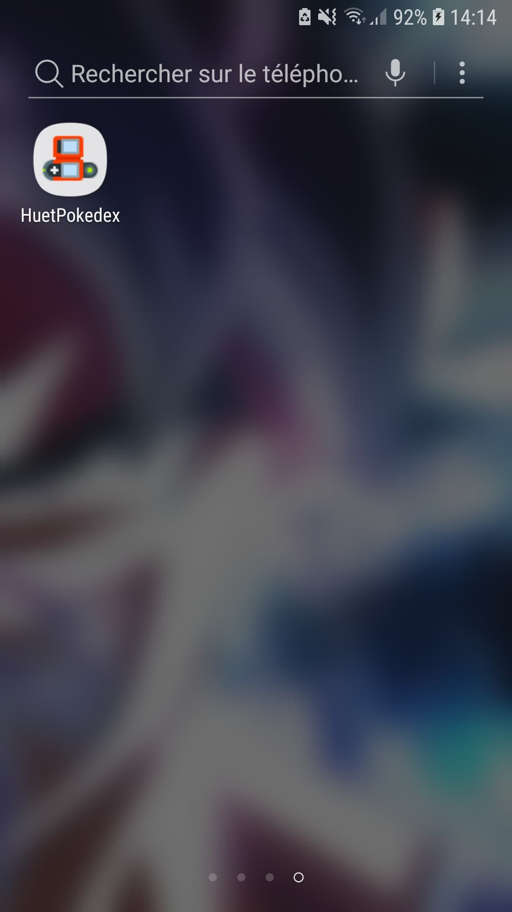

# POKEDEX

## Auteur

- Nicolas Huet

## Présentation

Application mobile utilisant une API pour recréer un pokédex regroupant les pokémons de la 1ère génération.

## Consignes

- 2 écrans avec deux activités, une avec la liste et une avec les détails
- appel service à une API
- barre de recherche
- icone pour l'appli

## Rendu

1) icone de l'application

Icone de pokédex trouvé sur internet.

                          
2) 1er écran

Affiche la liste de tous les pokémons

3) bar de recherche

Affiche la liste des pokémons contenant dans leurs noms les lettres tapées dans la barre de recherche.

4) détail deuxième écran

Affiche les détails du pokémon : son nom, son numéro dans le pokédex, son poids, sa taille et son ou ses type(s).

